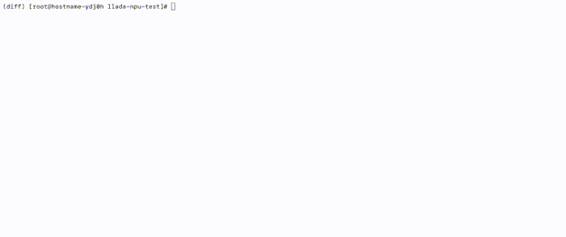

# LLaDA模型预训练与微调实战

## 📖简介

<p align="center">

</p>

在前面的章节中，我们展示了很多关于自回归模型的训练方法，哪怕是多模态模型，其中LLM部分也是基于自回归模型的（第六章）。在我们的课程里并没有完整的关于diffusion模型，也就是扩散模型的训练方法。本次教程我们就来实现diffusion模型的预训练以及微调，其中**微调为核心，预训练仅做尝试以及验证相关论文中的论点即可。**

其中扩散模型我们选择LLaDA模型，微调数据集还是采用经典的instruct数据集alpaca，预训练数据集经过多次试验，我们采用C4数据集来进行训练。

> 作者信息：情感机器实验室研究员-李馨雨  
> 邮箱：wind.340171@gmail.com

**📚资料**

- **数据集**：[pretrain](https://www.modelscope.cn/datasets/allenai/c4)，[sft](https://www.modelscope.cn/datasets/AI-ModelScope/alpaca-gpt4-data-zh)
- **模型**：[llada-8b](https://www.modelscope.cn/models/GSAI-ML/LLaDA-8B-Base)
- **框架**：[dllm](https://github.com/ZHZisZZ/dllm)
- **SwanLab**：[llada-swanlab](https://swanlab.cn/@LiXinYu/llada-npu-sft/overview)

> 本次教程llada微调的时候显存占用$\le35 GB$

**详细教程和SwanLab观测结果链接如下：**

[](https://zhuanlan.zhihu.com/p/2003124963071266869)
[](https://swanlab.cn/@LiXinYu/llada-npu-sft/overview)


本次教程代码源于[dllm](https://github.com/ZHZisZZ/dllm)，里面有完整的llada模型预训练以及微调方法，在此感谢作者开源llada训练框架🙏。

<div style="display:flex;justify-content:center;">
  <figure style="text-align:center;margin:0;">
    
  </figure>
</div>


## ⚙️环境安装

- 克隆代码

```bash
git clone https://github.com/828Tina/llada-pretrain-sft.git
cd llada-pretrain-sft
```

- 安装环境

```bash
pip install -r requirements.txt -i https://pypi.tuna.tsinghua.edu.cn/simple
```

- 硬件要求

GPU-32GB $\ge 1$

## 📊数据处理


在简介中我们强调，SFT是核心，因此我会按照SFT需要的数据集格式来讲述，预训练其实遵循的是同样的步骤，只不过预训练需要的是text数据而已。

首先我们需要下载数据集，我希望用本地的数据集来完成本次微调，参考了[datasets](https://huggingface.co/docs/datasets/process#save)关于数据保存和使用的代码，觉得以 `Arrow` 格式保存到本地磁盘然后读取的方式更方便，`Arrow` 是未压缩的，因此重新加载速度更快，非常适合本地磁盘使用和临时缓存。

上述过程主要使用`save_to_disk`和`load_from_disk`保存和加载数据集，不过如果磁盘空间有限，建议还是直接用`load_dataset`。

<div style="background:#e7f8ff;color:#000;padding:12px 16px;border-left:4px solid #20c0ff;">如果想直接预处理数据集的小伙伴，可以直接运行<a href="https://gitee.com/tina_3592874/llada-npu-test/blob/master/data.ipynb"target="_blank" rel="noopener">notebook</a>中的代码
</div>

## 🔧训练启动

那么接下来我们就开始训练吧，由于我已经整理过代码，因此可以直接运行脚本文件实现，下面简要说下每个文件的含义和用法：

```python
├── configs
│   ├── llada-100M-pt.yaml          # llada预训练超参数设置
│   ├── llada-8b-sft.yaml           # llada微调超参数设置
│   ├── qwen2.5-100M-pt.yaml        # qwen预训练超参数设置
│   ├── qwen2.5-7b-alpaca.yaml      # qwen微调超参数设置
│   ├── ddp.yaml      # 数据并行分布式训练参数设置
│   ├── zero2.yaml
│   └── ...
├── dllm
├── scripts
│   ├── train-pt.sh      # llada预训练启动
│   ├── train-sft.sh     # llada微调训练启动
│   ├── train-qwen-pt.sh       # qwen预训练启动
│   ├── train-qwen.sh      # qwen微调训练启动
│   ├── eval-llada.sh     # llada批量测试启动
│   └── eval-qwen.sh      # qwen批量测试启动
├── examples
│   ├── llada
│   │   ├── pt.py
│   │   ├── sft.py
│   │   ├── chat.py      # 终端交互式对话
│   │   └── generate.py  # llada推理代码
│   ├── qwen
│   │   ├── pt.py
│   │   ├── sft.py
│   │   ├── chat.py      # 终端交互式对话
│   │   └── utils.py
```

- `configs`：包含训练超参数设置、deepspeed分布式训练参数设置等
- `scripts`：训练启动文件、eval启动文件等
- `examples`：核心微调、预训练训练代码等


**预训练启动**

- llada预训练启动

```bash
bash scripts/train-pt.sh
```

- qwen预训练启动(非必需)

```bash
bash scripts/train-qwen-pt.sh
```

**微调启动**

- llada微调启动

```bash
bash scripts/train-sft.sh
```

- qwen微调启动

```bash
bash scripts/train-qwen.sh
```

**推理启动**

- llada模型推理

<div style="display:flex;justify-content:center;">
  <figure style="text-align:center;margin:0;">
    
  </figure>
</div>


```bash
python examples/llada/chat.py \
    --model_name_or_path "/root/models/LLaDA/output/merge-llada-8b-epoch-3-lr-2e-5" \
    --steps 128 \
    --max_length 128 \
    --block_length 32
```


- qwen模型推理

<div style="display:flex;justify-content:center;">
  <figure style="text-align:center;margin:0;">
    
  </figure>
</div>

```bash
python examples/qwen/chat.py \
        --model_name_or_path /root/models/Qwen/qwen2.5-7b-it \
        --max_new_tokens 256
```